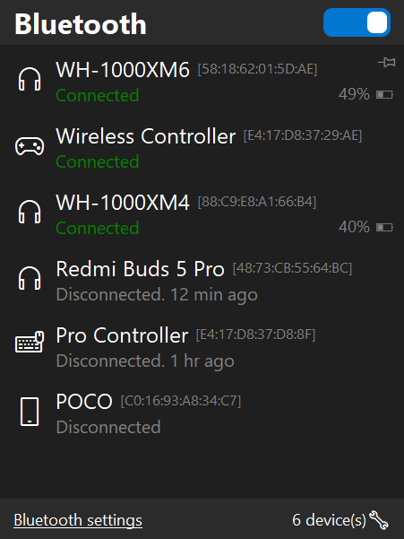

# Bluetooth Quick Connect

A Windows tray application for quick Bluetooth device management.



## Why This Exists

Windows 11 removed the convenient quick-connect popup that existed in Windows 10. Now connecting to a Bluetooth device requires navigating through Settings or multiple clicks in the system tray. This application brings back that convenience.

## Features

- Quick access from system tray or global hotkey
- Connect/disconnect devices with a single click
- Shows device connection status and battery level
- Per-device configuration for auto-connect and notifications
- Bluetooth radio on/off toggle
- Remembers recently seen devices
- Customizable themes
- Portable - single executable, no installation required

## Requirements

- Windows 10 or later
- Bluetooth adapter

## Installation

Download the latest release and run `bqc.exe`. The application will minimize to the system tray.

For autostart, enable it in Settings > General > Start with Windows.

## Usage

**Showing the Window**
- Click the tray icon, or
- Press the global hotkey (default: Win+K)

**Connecting a Device**
- Click on any device in the list to toggle its connection

**Bluetooth Radio**
- Use the toggle switch at the bottom to turn Bluetooth on/off

**Settings**
- Right-click the tray icon and select Settings, or
- Click the gear icon in the main window

## Configuration

Settings are stored in `bqc.ini` next to the executable. Most options are available through the Settings dialog:

| Tab        | Options                                   |
|------------|-------------------------------------------|
| General    | Window mode, always on top, autostart     |
| Hotkey     | Global hotkey, low-level hook mode        |
| Appearance | Theme, device icons, time format          |
| Layout     | Font sizes, item dimensions, colors       |
| Connection | Timeout, retry behavior                   |
| Logging    | Enable logging, log level                 |
| Devices    | Per-device auto-connect and notifications |

## Building from Source

Requirements:
- RAD Studio (Delphi) 12.x or later

Steps:
1. Open `bqc.dproj` in RAD Studio
2. Select target platform (Win32 or Win64)
3. Select configuration (Debug or Release)
4. Build (Shift+F9)

Output will be in `Win64/Release/bqc.exe` (or corresponding platform/config folder).

### Running Tests

1. Open `tests/BQCTests.dproj`
2. Build and run

## Project Structure

```
src/
  Domain/         - Core types and interfaces
  Infrastructure/ - Windows API integration, configuration
  Application/    - Business logic and presenters
  Presentation/   - UI forms and components
tests/            - Unit tests (DUnitX)
themes/           - VCL style files (.vsf)
resources/        - Icons
```

## License

GPL 3.0. See [LICENSE.txt](LICENSE.txt) for details.
